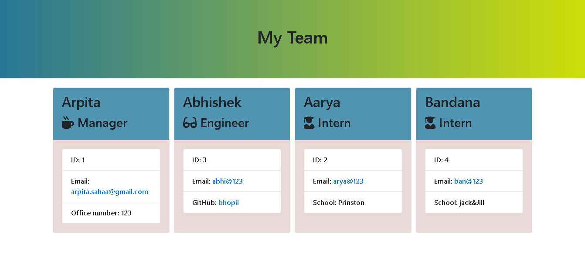

  # Welcome to employee summery (1.0.0)
  <a href="#">
    
  </a>


  ## Description 

  > 
This is a software engineering team generator command line application. The application will prompt the user for information about the team manager and then information about the team members. The user can input any number of team members, and they may be a mix of engineers and interns. After collecting all the information a team summary html page is generated.


  ---
### Screen shots
---




---
 
  ## Table of Contents

  * [Homepage](#homepage)
  * [Installation](#installation)
  * [Usage](#usage)
  * [Tests](#tests)
  * [Author](#author)
  * [Contributing](#contributing)
  * [License](#license)
  * [Questions](#questions)
  
  
  ## Homepage

  🏠 [Homepage](https://github.com/arpita-sahakar/employee-summary#readme)
  

  ## Installation
  ```bash
  node app.js
  ```

 
  ## Usage 
  ```bash
  node app.js
  ```


  ## Tests
  ```bash
  npm run test
  ```


  ## Author

  👤 **Arpita Kar**
  * GitHub: [@arpita-sahakar](https://github.com/arpita-sahakar)


  ## Contributing

  Contributions, issues and feature requests are welcome!

  Feel free to check [issues page](https://github.com/arpita-sahakar/employee-summary/issues). You can also take a look at the [contributing guide](https://github.com/arpita-sahakar/employee-summary).


  ## Questions

  Please send your questions and suggestions to [my email](arpita.sahaa@gmail.com)
  * GitHub: [@arpita-sahakar](https://github.com/arpita-sahakar)


  ## License

  Copyright © 2020 [Arpita Kar](https://github.com/arpita-sahakar).

  This project is [NPM](https://github.com/arpita-sahakar/employee-summary/blob/main/license) licensed.

  
 